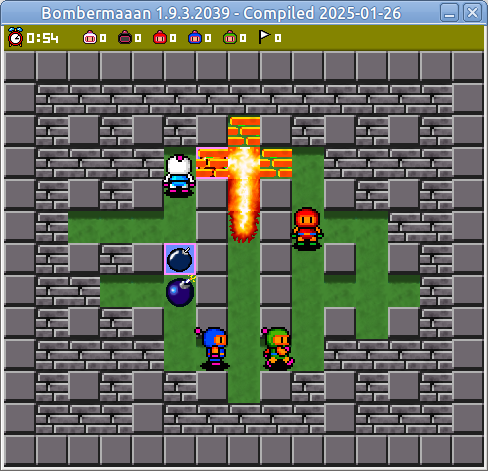

[](https://www.gnu.org/licenses/gpl-3.0)


# Bombermaaan

 
 

## Copyright

- 2000-2002, 2007 Thibaut Tollemer
- 2007, 2008 Bernd Arnold
- 2008 Jerome Bigot
- 2008 Markus Drescher
- 2016 Billy Araujo

## License

Bombermaaan is free software: you can redistribute it and/or modify
it under the terms of the GNU General Public License as published by
the Free Software Foundation, either version 3 of the License, or
(at your option) any later version.

Bombermaaan is distributed in the hope that it will be useful,
but WITHOUT ANY WARRANTY; without even the implied warranty of
MERCHANTABILITY or FITNESS FOR A PARTICULAR PURPOSE.  See the
GNU General Public License for more details.

You should have received a copy of the GNU General Public License
along with Bombermaaan.  If not, see \<[http://www.gnu.org/licenses/](http://www.gnu.org/licenses/)\>.
	
## Introduction

This is a version of Thibaut's Bombermaaan game project
which started on July 2000. He didn't develop this
project in order to bring new concepts of gameplay
or to make the best Bomberman game ever but to
increase his programming skills and have a game
project he can show to be hired.

## History

This program is still, and will always be under 
development. You can check the latest history of 
this project by browsing [its website](http://bombermaaan.sourceforge.net/). You'll be 
informed of what was changed, fixed, added, and 
removed in each version.

## System requirements

This program has been tested under Ubuntu 20.04.

## Parameters and switches for Linux

When Bombermaaan is called without a command line parameter (started with mouse click for example),
the game fetches level files from the directory \<path-to-executable-file\>/levels. The configuration
file named config.xml and log file named log.txt are read and/or written in the current working directory.

If you don't like the dynamic files (config.xml and log.txt) being in the current working directory,
you can pass the `--use-appdata-dir` switch to the executable. **This behaviour is NOT enabled by default.**
To enable the use of `~/.Bombermaaan`, append `--use-appdata-dir` when calling the Bombermaaan executable file.

You can call Bombermaaan with the `--help` switch to see a message box with copyright and license notice.

## Controls

During a match :
- Here are the configurations :
  - Keyboard 1 (Default) : Up/Down/Left/Right + X/Z
  - Keyboard 2 (Default) : 8/5/4/6 + Y/T
  - Keyboard 3 (Default) : I/K/J/L + 8/7
  - Keyboard 4 (Default) : H/N/B/M + 5/4
  - Keyboard 5 (Default) : R/F/D/G + 1/2
  - Joystick X (Default) : Up/Down/Left/Right + Button1/Button2
- On your configuration :
  - Up/Down/Left/Right : make your bomber move
  - Action 1 : drop a bomb if possible,
               or lift the bomb you are onto.
               hold Action 1 to hold the bomb.
               release Action 1 to throw the bomb.
  - Action 2 : stop a bomb you kicked that is still rolling,
               or punch a bomb that is right in front of you,
               or remote fuse a bomb.
- Escape : pause the match and make the menu box appear
- P : pause or resume

In the menu screens :
- Up/Down............... : select another field to modify
- Left/Right............ : change value of current field
- Backspace............. : previous screen
- Return/Space bar/Enter : next screen

In the menu box :
- Arrows................ : change between yes or no
- Return/Space bar/Enter : validate choice
- Escape................ : make the menu box disappear and resume the match

Anywhere in the game :
- F3...... : set 640x480 display mode
- F4...... : set windowed display mode

Please note that the display mode you chose may be unavailable on your computer.
The program will not change the display mode if this one is unavailable.

## Credits

- 2000-2002, 2007 Thibaut Tollemer
- 2007, 2008 Bernd Arnold
- 2008 Jerome Bigot
- 2008 Markus Drescher
- 2016 Billy Araujo

Bombermaaan is using TinyXML from [https://sourceforge.net/projects/tinyxml](https://sourceforge.net/projects/tinyxml).

Bombermaaan is using [Doxygen](http://www.doxygen.org/index.html) for [documentation](http://bombermaaan.sourceforge.net/doxydoc/html/) purposes.

Bombermaaan is using SimpleIni from [http://code.jellycan.com/simpleini/](http://code.jellycan.com/simpleini/).

## Project host

The original Bombermaaan project is hosted on SourceForge.net. 

## Compiling

```
zig build                           # for debug build
zig build -Doptimize=ReleaseSafe    # for release build
```

Tested on Ubuntu 20.04 using zig 0.14.0-dev.1911+3bf89f55c (2024.10.0-mach).
